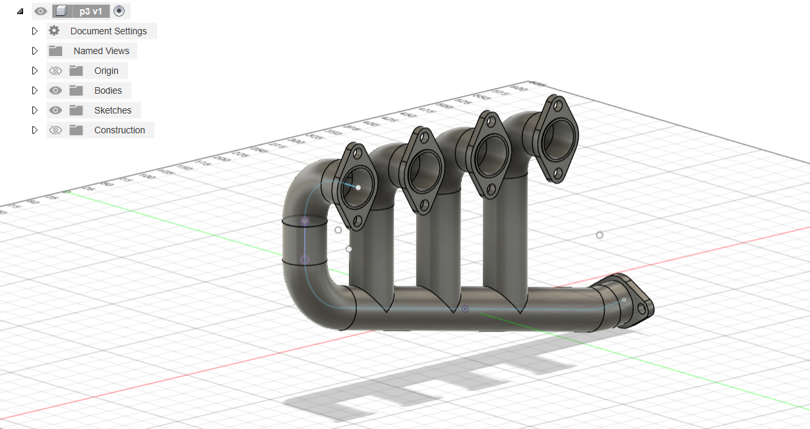

# 4-Cylinder Exhaust Manifold CAD Model

## Description

This repository contains a 3D CAD model of a **4-cylinder exhaust manifold**, designed using **Autodesk Fusion 360**. The model represents the exhaust component that collects exhaust gases from multiple cylinders into one pipe.

## Features

- 4 individual cylinder inlets with flange mounts
- Smooth curved runners for optimal flow
- Single outlet flange for connection to the downpipe
- Designed with clean parametric modeling techniques
- Assembly-ready layout for 3D printing or CNC fabrication

## Applications

- Automotive exhaust system design
- Academic and training purposes
- Simulation and flow analysis (CFD)
- 3D printing prototypes for performance testing

## Future Improvements

- Add heat shield mounts
- Perform flow simulation (CFD)
- Optimize runner lengths for performance tuning

